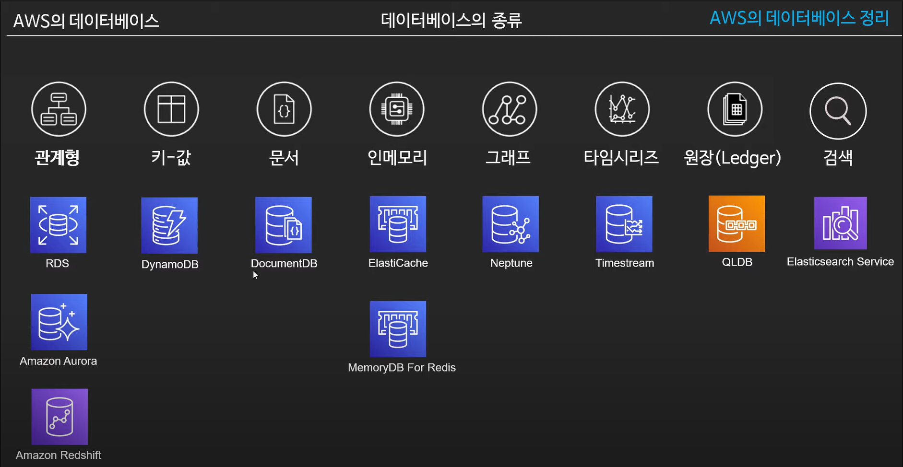
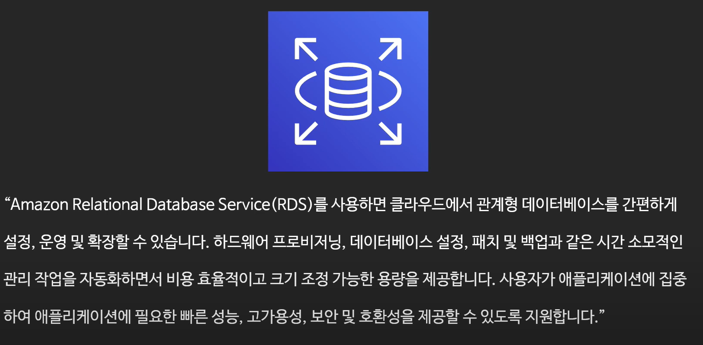
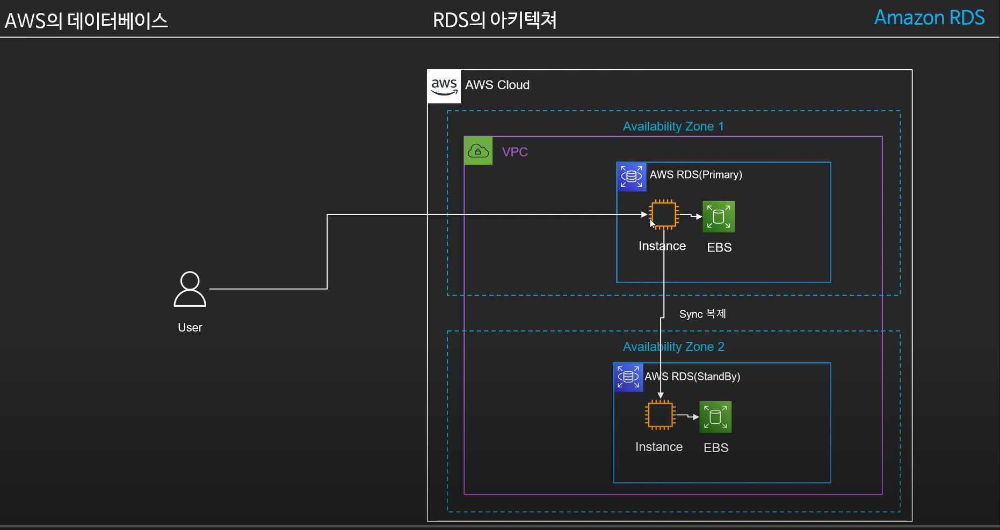
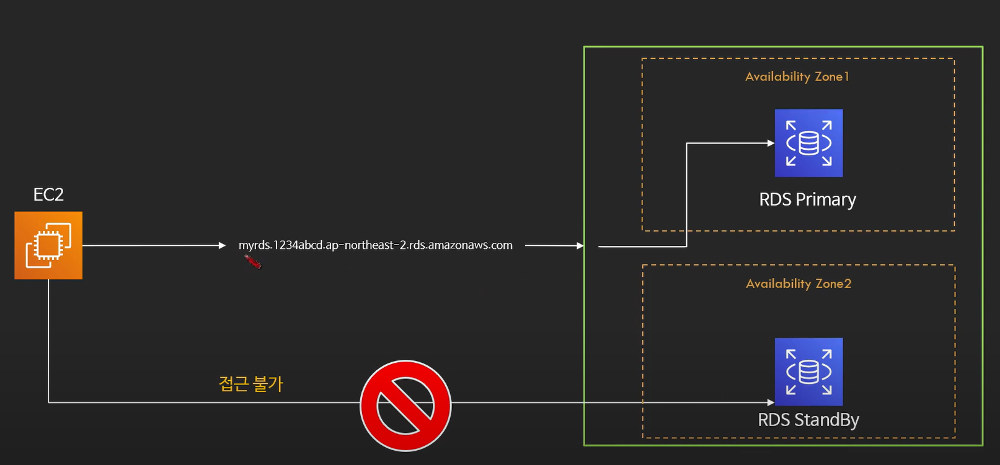
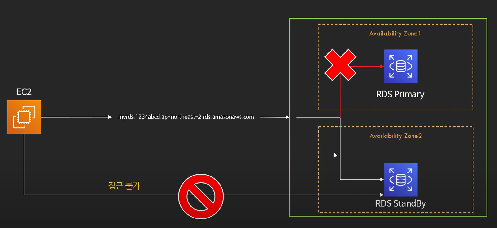
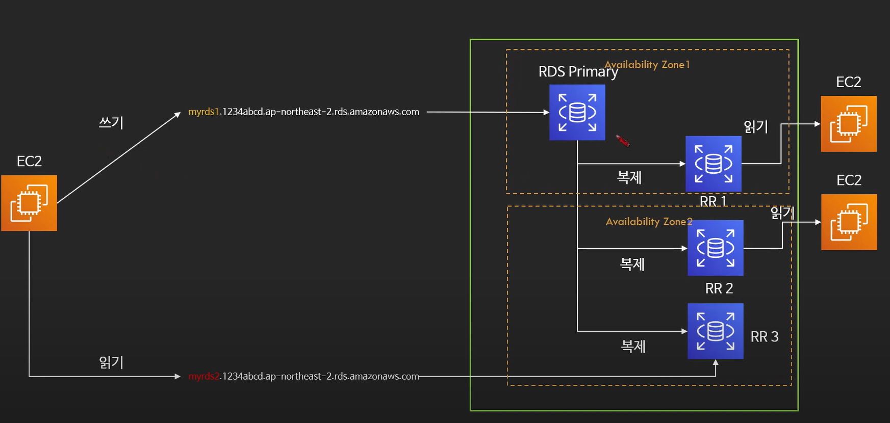
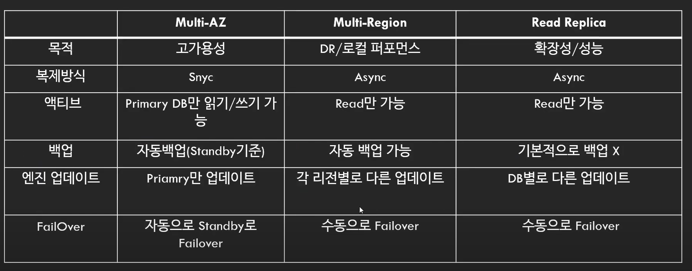
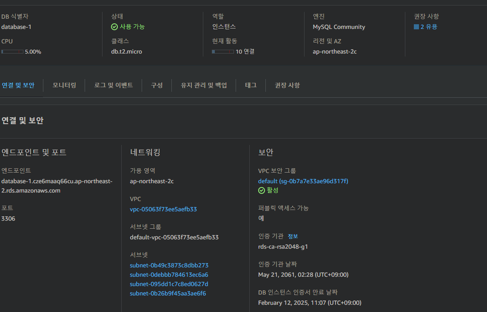
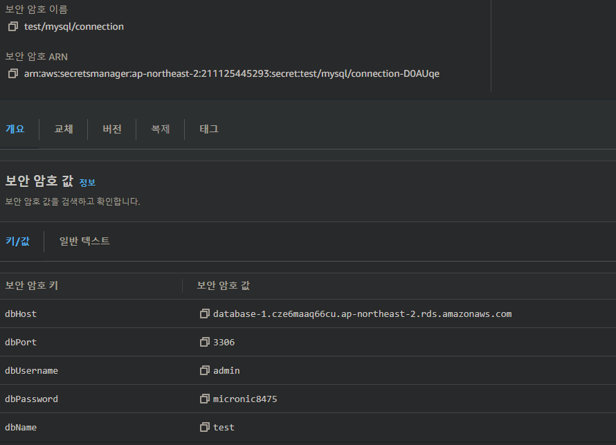

# AWS의 데이터베이스 정리
> https://www.youtube.com/watch?app=desktop&v=mRBpWLssAZQ




# RDS : Relational Database Service
> https://www.youtube.com/watch?v=koDIV5QMw38&list=PLfth0bK2MgIYeqduNcrURm5NZieCowvcK&index=1




- 관계형 데이터 베이스를 제공하는 서비스
- 가상머신위에서 동작 : 직접 시스템에 로그인하는것은 불가능. (AWS에서 알아서관리)
- RDS는 서버리스 서비스는 아니다. (Auroa는 Serverless입니다.)
- CloudWatch와 연동된다. EC2처럼 상태 확인 가능.
- 내부적으로 EC2로 구성되어있으며 VPC안에서 동작함
    - 기본적으로 Public IP를 부여하지 않아 외부접근은 불가능
    - 설정에 따라 Public으로 오픈 가능 / DNS로 접근
    - 서브넷과 보안그룹 지정 필요
    - EC2타입의 지정이 필요함
    - Storage는 EBS를 사용함. : EBS의 용량을 지정해서 생성한다.
- 업데이트
    - 마이너버전 엔진 업데이트는 자동으로 업데이트 설정가능
    - 기타업데이트의 경우 점검시간을 설정하여 특정시간에 업데이트가 이루어지도록함

### RDS의 인증방법
- 전통적인 유저 / 패스워드 방식
    - aws secret manager와 연동하여 자동 로테이션 가능
- IAM DB인증 : IAM role을 통해서 관리 가능
- Kerberos인증

### RDS 가격 모델
- 컴퓨팅파워 + 스토리지용량 + 백업용량 + 네트워크 비용을 합침
- EC2처럼 ReservedInstance 구매가능

### RDS의 백업
- 자동백업
    - 매일 스냅샷을 만들고 트렌젝션 로그를 저장
    - 데이터는 S3에 저장되며 데이터베이스의 크기만큼 공간점유
    - 저장된 데이터를 바탕으로 일정 기간내의 특정시간으로 롤백가능
        - 다른 DB클러스터를 새로 생성
      > 스냅샷을 기반으로 새로운 디비를 구성하고 트렌젝션 로그대로 복구
    - 1-35일까지 보관지원
    - 기본적으로 사용 상태로 설정되어있음
- 수동백업 (수동 스냅샷)
    - 요청에 의해 만들어지는 스냅샷
    - 데이터베이스가 삭제된 이후에도 계속 보관됨
    - 스냅샷의 복구는 항상 새로운 DB인스턴스를 생성하여 수행

### RDS의 Multi AZ
- 두개이상의 가용영역에 걸처 데이터베이스를 구축하고 원본과 다른 DB를 동기화시킴
- primary DB장애 발생시 자동으로 다른 DB가 원본으로 승격됨
- Standby디비는 접근이 불가능
- oracle, SQL SERVER, Mysql, PostgreSQL, MariaDB에서 지원
  
  

### 읽기전용 복제본 (Read Replica)
- 원래 데이터베이스의 읽기전용 복제본을 생성
    - 쓰기는 원본 디비에, 읽기는 복제본에서 처리하여 워크로드 분산
- 퍼포먼스를 위한 서비스
- 총 5개까지 생성가능
- 각각의 복제본은 DNS가 할당되며 접근이 가능함
- Multi-AZ DB에 읽기전용 복제본 설정이 가능함
- 자동 백업이 활성화 되어있어야 복제본 생성이 가능함
- 메인인스턴스에서 에러가 발생시 수동으로 전환해줄수있음.


### 비교표


> 실습 : Multi-az 구성 : 30:20 부터


###  My RDS FreeTier Mysql



# Secret Manager
> https://www.youtube.com/watch?app=desktop&v=I-bgXqpuOqU

### 요금
- 보안 암호당 $0.40/월
- API 호출 10,000건당 $0.05

### Secret Manager Use Case
- 데이터베이스 패스워드
- 어플리케이션의 중요정보 (lambda, EC2, ECS/EKS)
- 3rd Party API Key
- 인증토큰, SSH, TLS


### Secret Manager & Spring 연동
> https://pgmjun.tistory.com/49
> https://www.youtube.com/watch?v=1j028KYS4ps

 
### AWS SecretManager & Spring 연동
- Secret Manager - 다른유형보안암호 생성
  
- IAM에서 admin 계정에 대한 Secret Manager 권한추가 : SecretManagerReadWrite
- IAM에서 Access Key를 생성한다.
- aws cli에서 IAM의 Access key ID, Secret access key를 등록해주어야 한다.!! 필히!!

- Gradle
  ```kotlin
  implementation("io.awspring.cloud:spring-cloud-starter-aws-secrets-manager-config:2.4.4")
  ```
- Application.property
  ```
  spring.config.import=optional:aws-secretsmanager:test/mysql/connection
  ```
- Database Connection 변경
  ```
  spring.datasource.url = jdbc:mysql://${dbHost}:${dbPort}/${dbName}?useSSL=false&serverTimezone=Asia/Seoul&characterEncoding=UTF-8
  spring.datasource.username = ${dbUsername}
  spring.datasource.password = ${dbPassword}
  ```
  
