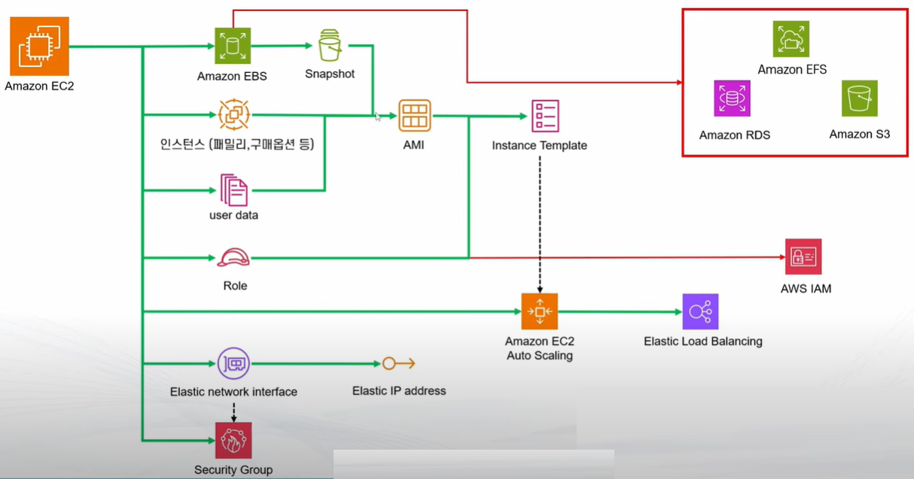
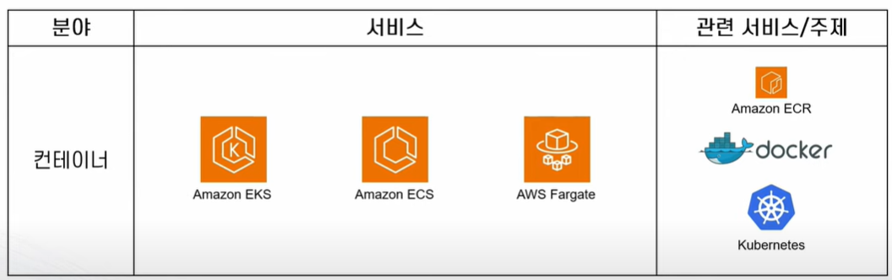
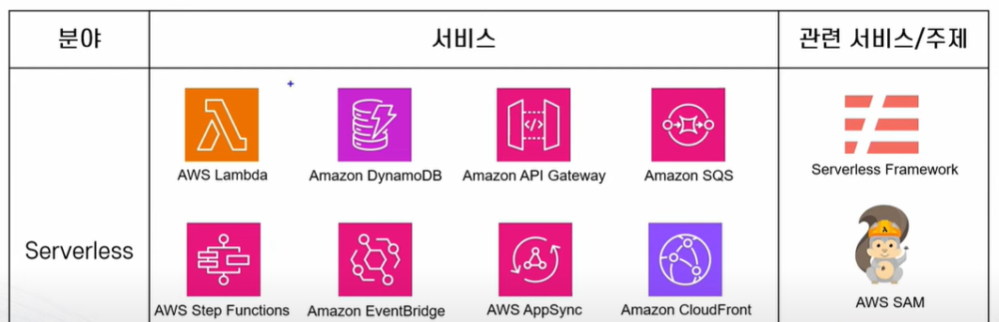
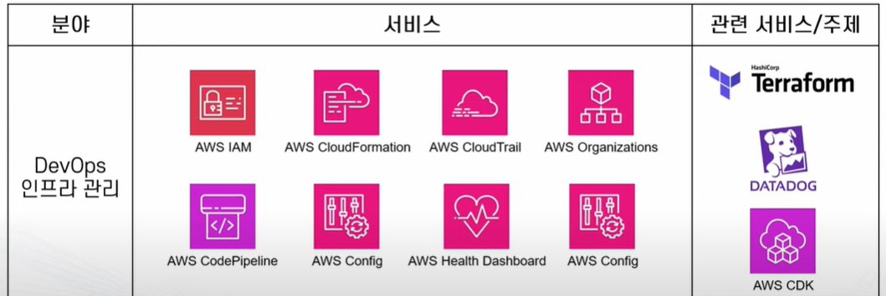
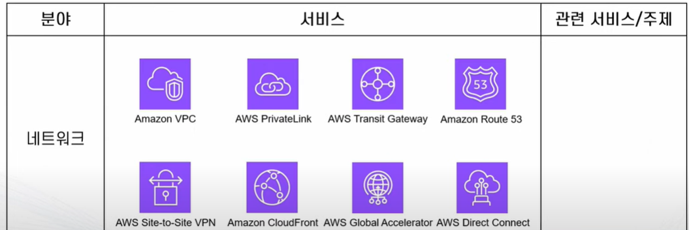
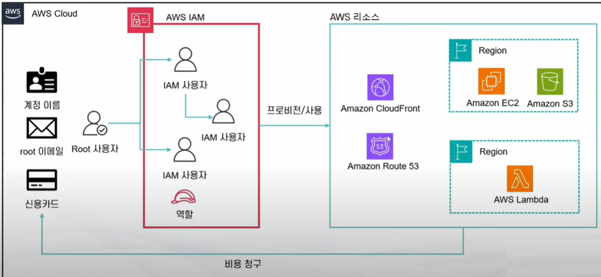
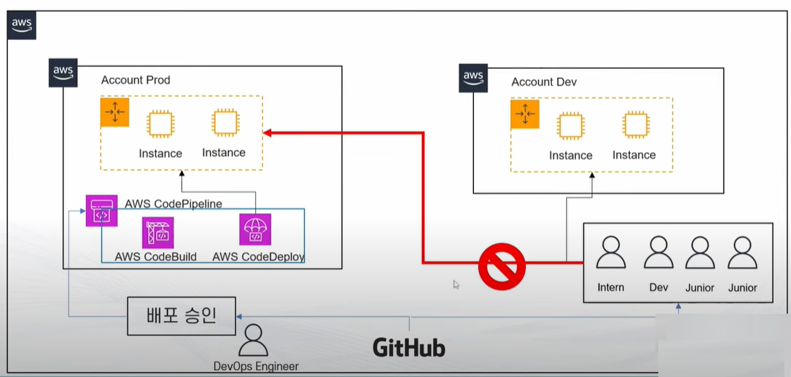

# Cloud Server & Serverless
 > https://www.youtube.com/watch?v=YSudWlx0o9I  // 240201
## About 인프라
###  IaaS
 - __VM__
 - 실제 서버는 있겠죠... 우리가 인지하지 못할뿐... :: VM개념이 등장 (가상화기능) : 이게 하나의 인스턴스가된다. 
 - 이런 인스턴스 : 즉 인프라를 하나의 서비스처럼 구독하게된다. (초창지 AWS가 이형태이다.)

### Paas
 - __Docker, Kube, Container등..__
 - OS자체를 서비스에서 뺀 녀석. 어플리케이션 자체만 서비스 할 수 있도록 구성해둠 
 - 설정들을 공유해서 이식성이나 증설에 편하다.

### SaaS
 - __EX> MS Office 365__ 
 - 내가 구지 내 컴터에 깔지 않고도 소프트웨어를 쓸수 있도록구성해둔것

### FaaS (Function as a Service)
 - Ex> AWS Lambda : 개발된 소스를 올리면... 그 소스의 기능을 수행하도록...개발되어있음
 - Serverless. (물론 실제 서버는 있겠죠...;; )
 - 아에 서버를 관리할(스케일업,다운등.의) 필요없이 특정 역활과 기능만을 수행 하도록.. 

------
# AWS 
 > https://www.youtube.com/watch?v=iX6X0rNmgzY   //240201

## AWS 공부 하기전에...
1. AWS계정 생성
2. 프리티어 :
   - EC2 : t3/t2.micro 월 750시간 
   - RDS : t2/t3/t4.micro 월 750 무료

3. 일정량무료 always : 
   - Lambda : 월 100만건
   - CloudFront : 1T 무료

4. 보안설정은 꼭 하고 들어가세요~

## 공부티어~ :: 넓게 이해한후 나중에 필요한걸 깊게 파세요~

 - 필수 티어 :
   - EC2 / AWS IAM 
   - 관련 : EBS, ELB, AutoScailing, Budget, Cost&Usage Report

 - 매우중요 :
   - VPC, S3, RDS
   - 관련 : Amazon Auroa
   - ​
 - 중요 : 
   - SQS, CloudFront, CloudFormatiopn, CloudWatch, Route53, SNS, SystemManager, CloudTrail

[아래 내용들은 먼저 공부하는게 좋아요]
### EC2 :: 
 - 컴퓨팅 파워를 빌리는 서비스 (즉 가상서버 빌려쓰기)
 - 대부분의 서비스가 여기랑 연결된다.
 - EBS라는 가상의 하드 드라이브와 연결되어있습니다~
 - 인스턴스 (어느 요금재, 어느사이즈의 CPU, RAM등등 선택)
    > EC2의 구성과 서비스 연동관계
    > 

### IAM ::  
 - Identity and Access Management  
 - 어카운트관리, 리소스, 사용자 서비스의 권한제어
 - 사용자의 생성 관리 계정의 보완

### VPC : 가상으로 존재하는 데이터센터? 정도로 생각하믄 된다.  (Private Service)
 - Virtual Private Cloud --> AWS 계정 전용 가상 네트워크
 - EC2, RDS같은 AWS리소스를 VPC에 엮어서 사용한다. 
 - IP 주소 VPC범위를 설정하고 서브넷 연결 // 라우팅 테이블구성
 - ​

### S3 
 - Simple Storage Service
 - 객체스토리지 서비스
 - 파일 보관만 가능하다. // 어플리케이션은 설치가 불가능

### RDS 
 - 관계형 데이터베이스르 서비스로 구성해둔것
 - 암호화 / 자동 백업 지원 //이중화를 고려할 필요가 없다~~~

[중요 서비스 종류들]

> 컨테이너 :: EKS, ECS, Fargate 등 
> 
> 
> 
> 
> 

### 외부적으로 공부 할라믄...
 - 자격증 :: Cloud Practitioner -> Solutions Architect
 - 책 :: AWS 교과서 / AWS 비용 최적화 바이블 
 - AWS 공식 프로그램 :: Builders Program?
 - AWS KRUG 소모임 

------

# AWS계정
> https://www.youtube.com/watch?v=VJ_cz7qj4ss   //240201

### AWS 계정이란? 
 - AWS에서 리소스를 관리하는 일반적인 최대 단위 :: 다양한 사용주체들이 생성된리소스를 사용한다.  계정 != 사용자
   > s3 계정당 최대 버킷 갯수 이런게 정해저있다.
   > 해킹같은 피해를 입어도 이 계정단위로 한정된다. (sandbox같은 역활도 한다.)

 - 계정은 무대 / 리소스는 소품 / 연기자는 사용자들 정도 되겠다.

### 계정 생성 방법
 - 이메일, 신용카드를 기준으로 신규 계정 생성
 - AWS Organization으로 생성
 - 계정생성시 Root사용자(admin같은 최고 사용자이다.) 가 자동으로 생성된다.

### Root 사용자만 가능한 작업 
 - 계정 설정변경/
 - 계정삭제
 - 요금관련 설정 (위임은 가능하다)
 - AWS Support Plan 구독.
   > 이말인즉... 이기능외에 다른 사용을 할때는 Root를 사용하지 말라...

### IAM 사용자
 - IAM을 이용해서 생성한 사용자이다.
 - 정책, 그룹을 통해 권한을 부여해서 활동하게 할수 있다.
 - Full admin권한이 부여가능 :: 이걸로 실제 관리 하도록 해야한다.

### 관리단위의 분리.
 
 - 계정단위로 영향력이 분리됨을 이용해서 DEV / PROD 계정을 분리 사용하는 경우가 많다.
 - 특정 권한을 가진 사람이 PROD로의 배포를 승인하도록 하는 경우가 많다.
 - 여러계정을 동시에 관리하고 싶다면... AWS Organizations / AWS Single Sign On을 참고.

-------

# AWS Free-Tier
> https://www.youtube.com/watch?v=Ah0jXNfllAk

> https://aws.amazon.com/ko/free/?all-free-tier.sort-by=item.additionalFields.SortRank&all-free-tier.sort-order=asc&awsf.Free%20Tier%20Types=*all&awsf.Free%20Tier%20Categories=*all

### AWS free-tier
 - 12개월 무료, 상시무료, 단기무료평가판 3가지로 나뉜다.
 - Cost Exploer / AWS Budgets 등으로 사용량 추적 및 알림이 가능함

### 언제나 무료~
 - 기존이든 신규든 일정기간동안 월 일정 사용량은 무료로~
 - Lambda : 100 만건 무료
 - CloudFront : 1TB데이터통신, HTTP 1000만건 , 함수 200만건 무료
 - DynamoDB : 25G 저장공간, 월별 2억개 처리용량 무료

### 12개월 무료.
 - 신규고객만 // 월 일정 사용량을 넘어서면 과금이됩니다.
 - EC2 : t2,micro, t3.micro :: 월 750시간  // 750시간은 인스턴스들의 사용시간합산임을 조심
 - RDS : db.t2.micro, db.t3.micro, db.t4micro 월 750시간 무료
 - ALB : 월 750 시간, 15LCU무료
 - EsCashe : 월 750 시간

### 무료평가판
 - 무료사용기간초과, 사용량 초과하면 요금이 발생합니다~~
 - QuickSight, Chime, Lightsail 등등...

### 기타
 - AWS에서 인터넷으로 데이터 전달은 월 100GB는 무료입니다. (EC2, S3, ELB등)
 - 인터넷에서 AWS로 들어오는 트레픽은 언제나 무료입니다~

### 프리티어 트랙킹 / 알람
 - AWS Free Tier Usage Alert: 각서비스 별로 85% 정도를 사용했을때 이멜로 알림
 - AWS Budget의 zero Spend budget 템플릿으로 알람 (더 정확한...)
 - Billing & Cost Manager에서 현재 사용량 확인가능

### Bubget설정 [강의 10분부터]
 - 버짓 -제로 지출예산으로 체크  :: 지출이 발생하면 바로 멜로 옵니다.
 - AWS 계정을 지키는 3가지~~

### 조심할것들~
 - EC2를 중지시켜도 EBS가 동작하는 지라 청구될수 있음.  반드지 종료 시키세요~
 - EBS 스냅샷, 백업에도 요금이 나옵니다~
 - 인스턴스 별로 시간은 따로 계산되니 조심하세요~
 - 내 EC2들 전체 보기는 -- EC2 Global view로 찾아보시면 되요
 - 프리티어 만료시 바로 과금됨. 경보같은거 없음
 - Organization에서는 하나의 계정만 프리티어다
 - 카드를 새로 만들어서 다시 프리티어 쓸수 있다.

