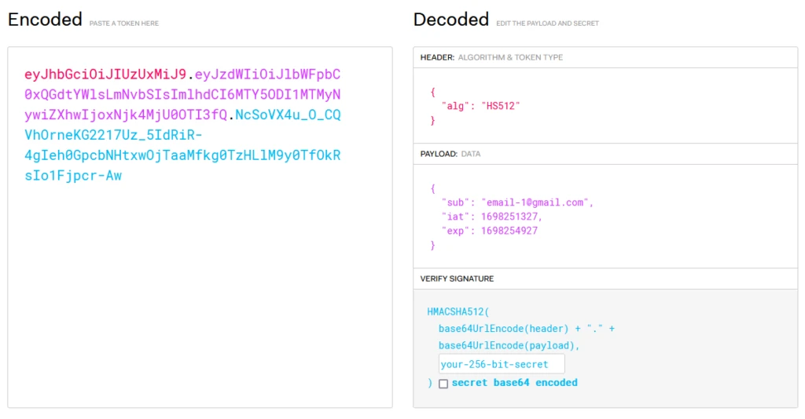

## Bird’s Eye View on Spring Security

Spring Security is like the security team of a building.
It manages authentication and authorization for our app with:

- Filters
  > think of security filters as checkpoints at different doors in the building.
  When a request comes in, it goes through these filters.
  These filters handle tasks like authentication and authorization.
  For instance, there might be a filter that checks
  if you have a proper access card (authentication),
  and another that ensures you can enter specific rooms (authorization).

- Authentication
  > when you log in, Spring Security checks your credentials (like username and password).
  If they match, you’re authenticated.
  Spring Security uses authentication providers, which can be a database,
  LDAP, or any other source, to verify your identity.

- Security Context
  > once authenticated, your security details are stored in the Security Context.
  It’s like being given a special pass after passing through the checkpoint.
  This pass (security context) contains your roles and permissions.

- Authorization
  > now, when you try to access a specific part of the application,
  Spring Security checks your roles and permissions stored in the security context.
  If you’re authorized (based on your roles), you’re allowed in.
  Otherwise, you might be denied access.

- Customization
  > Spring Security allows you to customize the security filters, authentication providers,
  and access rules according to your application’s requirements.
  You can configure which URLs need authentication,
  what roles are required, etc.
  

## 다른 프로젝트에 모듈로 병합시!!
 - security.repository.UserRepository에 UserDetailService.loadUserByUsername과 연결시킬
   함수를 구현한후 UserDetails가 완성될수 있도록 정보를 제공해주면 된다.

- JWT 구조
