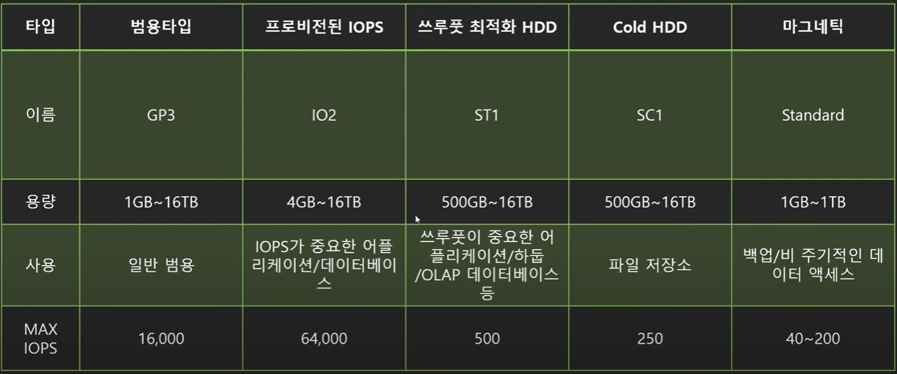

# Cloud Server & Serverless
 > https://www.youtube.com/watch?v=YSudWlx0o9I  // 240201

## Cloud 컴퓨팅의 이점
- 초기투자비용이 적음
- 수요에 대한 빠른대처 가능 : 불확실한 수요 예측에서 오는 손해가 적다,
- 규모의 경제의 혜택을 볼수 있음
- 제품의 개발에 집중가능
- 유지보수가 쉬움

## About 인프라
###  IaaS
 - __VM__
 - 실제 서버는 있겠죠... 우리가 인지하지 못할뿐... :: VM개념이 등장 (가상화기능) : 이게 하나의 인스턴스가된다. 
 - 이런 인스턴스 : 즉 인프라를 하나의 서비스처럼 구독하게된다. (초창지 AWS가 이형태이다.)

### Paas
 - __Docker, Kube, Container등..__
 - OS자체를 서비스에서 뺀 녀석. 어플리케이션 자체만 서비스 할 수 있도록 구성해둠 
 - 설정들을 공유해서 이식성이나 증설에 편하다.

### SaaS
 - __EX> MS Office 365__ 
 - 내가 구지 내 컴터에 깔지 않고도 소프트웨어를 쓸수 있도록구성해둔것

### FaaS (Function as a Service)
 - Ex> AWS Lambda : 개발된 소스를 올리면... 그 소스의 기능을 수행하도록...개발되어있음
 - Serverless. (물론 실제 서버는 있겠죠...;; )
 - 아에 서버를 관리할(스케일업,다운등.의) 필요없이 특정 역활과 기능만을 수행 하도록.. 

------
# AWS 
 > https://www.youtube.com/watch?v=iX6X0rNmgzY   //240201

## AWS 공부 하기전에...
1. AWS계정 생성
2. 프리티어 :
   - EC2 : t3/t2.micro 월 750시간 
   - RDS : t2/t3/t4.micro 월 750 무료

3. 일정량무료 always : 
   - Lambda : 월 100만건
   - CloudFront : 1T 무료

4. 보안설정은 꼭 하고 들어가세요~

## 공부티어~ :: 넓게 이해한후 나중에 필요한걸 깊게 파세요~

 - 필수 티어 :
   - EC2 / AWS IAM 
   - 관련 : EBS, ELB, AutoScailing, Budget, Cost&Usage Report

 - 매우중요 :
   - VPC, S3, RDS
   - 관련 : Amazon Auroa
   - ​
 - 중요 : 
   - SQS, CloudFront, CloudFormatiopn, CloudWatch, Route53, SNS, SystemManager, CloudTrail

[아래 내용들은 먼저 공부하는게 좋아요]
### EC2 :: 
 - 컴퓨팅 파워를 빌리는 서비스 (즉 가상서버 빌려쓰기)
 - 대부분의 서비스가 여기랑 연결된다.
 - EBS라는 가상의 하드 드라이브와 연결되어있습니다~
 - 인스턴스 (어느 요금재, 어느사이즈의 CPU, RAM등등 선택)
    > EC2의 구성과 서비스 연동관계
    > 

### IAM ::  
 - Identity and Access Management  
 - 어카운트관리, 리소스, 사용자 서비스의 권한제어
 - 사용자의 생성 관리 계정의 보완

### VPC : 가상으로 존재하는 데이터센터? 정도로 생각하믄 된다.  (Private Service)
 - Virtual Private Cloud --> AWS 계정 전용 가상 네트워크
 - EC2, RDS같은 AWS리소스를 VPC에 엮어서 사용한다. 
 - IP 주소 VPC범위를 설정하고 서브넷 연결 // 라우팅 테이블구성
 - ​

### S3 
 - Simple Storage Service
 - 객체스토리지 서비스
 - 파일 보관만 가능하다. // 어플리케이션은 설치가 불가능

### RDS 
 - 관계형 데이터베이스르 서비스로 구성해둔것
 - 암호화 / 자동 백업 지원 //이중화를 고려할 필요가 없다~~~

[중요 서비스 종류들]

> 컨테이너 :: EKS, ECS, Fargate 등 
> 
> 
> 
> 
> 

### 외부적으로 공부 할라믄...
 - 자격증 :: Cloud Practitioner -> Solutions Architect
 - 책 :: AWS 교과서 / AWS 비용 최적화 바이블 
 - AWS 공식 프로그램 :: Builders Program?
 - AWS KRUG 소모임 

------

# AWS계정
> https://www.youtube.com/watch?v=VJ_cz7qj4ss   //240201

### AWS 계정이란? 
 - AWS에서 리소스를 관리하는 일반적인 최대 단위 :: 다양한 사용주체들이 생성된리소스를 사용한다.  계정 != 사용자
   > s3 계정당 최대 버킷 갯수 이런게 정해저있다.
   > 해킹같은 피해를 입어도 이 계정단위로 한정된다. (sandbox같은 역활도 한다.)

 - 계정은 무대 / 리소스는 소품 / 연기자는 사용자들 정도 되겠다.

### 계정 생성 방법
 - 이메일, 신용카드를 기준으로 신규 계정 생성
 - AWS Organization으로 생성
 - 계정생성시 Root사용자(admin같은 최고 사용자이다.) 가 자동으로 생성된다.

### Root 사용자만 가능한 작업 
 - 계정 설정변경/
 - 계정삭제
 - 요금관련 설정 (위임은 가능하다)
 - AWS Support Plan 구독.
   > 이말인즉... 이기능외에 다른 사용을 할때는 Root를 사용하지 말라...

### IAM 사용자
 - IAM을 이용해서 생성한 사용자이다.
 - 정책, 그룹을 통해 권한을 부여해서 활동하게 할수 있다.
 - Full admin권한이 부여가능 :: 이걸로 실제 관리 하도록 해야한다.

### 관리단위의 분리.
 
 - 계정단위로 영향력이 분리됨을 이용해서 DEV / PROD 계정을 분리 사용하는 경우가 많다.
 - 특정 권한을 가진 사람이 PROD로의 배포를 승인하도록 하는 경우가 많다.
 - 여러계정을 동시에 관리하고 싶다면... AWS Organizations / AWS Single Sign On을 참고.

-------

# AWS Free-Tier
> https://www.youtube.com/watch?v=Ah0jXNfllAk

> https://aws.amazon.com/ko/free/?all-free-tier.sort-by=item.additionalFields.SortRank&all-free-tier.sort-order=asc&awsf.Free%20Tier%20Types=*all&awsf.Free%20Tier%20Categories=*all

### AWS free-tier
 - 12개월 무료, 상시무료, 단기무료평가판 3가지로 나뉜다.
 - Cost Exploer / AWS Budgets 등으로 사용량 추적 및 알림이 가능함

### 언제나 무료~
 - 기존이든 신규든 일정기간동안 월 일정 사용량은 무료로~
 - Lambda : 100 만건 무료
 - CloudFront : 1TB데이터통신, HTTP 1000만건 , 함수 200만건 무료
 - DynamoDB : 25G 저장공간, 월별 2억개 처리용량 무료

### 12개월 무료.
 - 신규고객만 // 월 일정 사용량을 넘어서면 과금이됩니다.
 - EC2 : t2,micro, t3.micro :: 월 750시간  // 750시간은 인스턴스들의 사용시간합산임을 조심
 - RDS : db.t2.micro, db.t3.micro, db.t4micro 월 750시간 무료
 - ALB : 월 750 시간, 15LCU무료
 - EsCashe : 월 750 시간

### 무료평가판
 - 무료사용기간초과, 사용량 초과하면 요금이 발생합니다~~
 - QuickSight, Chime, Lightsail 등등...

### 기타
 - AWS에서 인터넷으로 데이터 전달은 월 100GB는 무료입니다. (EC2, S3, ELB등)
 - 인터넷에서 AWS로 들어오는 트레픽은 언제나 무료입니다~

### 프리티어 트랙킹 / 알람
 - AWS Free Tier Usage Alert: 각서비스 별로 85% 정도를 사용했을때 이멜로 알림
 - AWS Budget의 zero Spend budget 템플릿으로 알람 (더 정확한...)
 - Billing & Cost Manager에서 현재 사용량 확인가능

### Bubget설정 [강의 10분부터]
 - 버짓 -제로 지출예산으로 체크  :: 지출이 발생하면 바로 멜로 옵니다.
 - AWS 계정을 지키는 3가지~~

### 조심할것들~
 - EC2를 중지시켜도 EBS가 동작하는 지라 청구될수 있음.  반드지 종료 시키세요~
 - EBS 스냅샷, 백업에도 요금이 나옵니다~
 - 인스턴스 별로 시간은 따로 계산되니 조심하세요~
 - 내 EC2들 전체 보기는 -- EC2 Global view로 찾아보시면 되요
 - 프리티어 만료시 바로 과금됨. 경보같은거 없음
 - Organization에서는 하나의 계정만 프리티어다
 - 카드를 새로 만들어서 다시 프리티어 쓸수 있다.

-----

# AWS 구조
>https://www.youtube.com/watch?v=tvwDDM-Y-qE

### AWS 구조

 
### 서비스가 존재하는 위치 별로 아래와 같이 구분된다.

 - 글로벌 서비스 : 리전에 따로 속해있지 않은 서비스
   + 전세계 모든인프라가 공유한다.
   + CloudFront, IAM, Route53, WAF(web application firewall)
 - 리전 서비스 : 리전에 속하는 서비스
   + 대부분의 서비스가 여기 속한다.
   + S3(데이터저장서비스): 전세계에서 동일하게 사용할수 있으나 데이터 자체는 리전에 종속된다.
 - 가용영역 서비스 : 특정 가용영역에 존재하는 서비스

### 리전
- 데이터 센터의 물리적 위치, 리전별로 가능한 서비스가 다름. (US-EAST1에 신규서비스가 위치한다.)
- 선택시 고려할점
   + 지연속도, 사용가능한 aws서비스, 
   + 법률(데이터, 서비스 제공관련)

### 가용영역 (availability zone)
- 리전의 하부단위 : 하나의 리전은 반드시 2개 이상의 가용영역으로 구성
- 하나이상의 데이터 센터로 구성. 가용영역간의 연결은 전용네트웍으로 연결됨
- 가용영역간 물리적으로 일정 거리 이상 떨어져있음 
- 가용영역은 유저와 데이터 센터간 맵핑을 해서 섞어서 사용한다.
  

### 엣지 로케이션 
 - AWS의 Cloud Front CDN등의 여러 서비스들을 가장 빠른속도로 제공하기위한 거점
 - 전세계 여러장소에 흩어져 있음
 - 주로 캐싱에 사용된다.

### ARN
 - AWS의 모든 리소스의 고유 아이디
 - 형식 : arn:[partition]:[service]:[region]:[account_id]:[resource_type]/resource_name/(qualifier)
 - wildcard(*)를 이용해서 다수 리소스 지정가능

------

# AWS 계정 생성
> https://www.youtube.com/watch?v=9nBq6PxDvp4&list=PLfth0bK2MgIan-SzGpHIbfnCnjj583K2m&index=5

### 루트유저
 - 모든 권한을 가짐
 - 생성시 만든 E mail로 로그인한다.
 - 탈취당하면 복구가 힘들다.... 사용을 자제하고 MFA(일회용 pw)설정이 필요하다.
 - 관리용으로만 이용하세요. :: 계정설정변경, 빌링등...
 - AWS api호출 불가능 

### IAM user 
 - Identity and Access Management를 토해 생성한 유저, 아이디로 로그인한다.
 - 기본권한 없음. 따로 권한을 부여받아야만 한다.
 - 꼭 사람이 아닌 어플리케이션등의 가상주체를 대표할수 있음
 - aws api호출 가능하다.
   + Access key : id 같은 개념
   + Secret Access key : 비밀번호 같은 개념

### 계정생성 실습 
 - 08:16 부터

------

# IAM
> https://www.youtube.com/watch?v=lcly_aIq1KI&list=PLfth0bK2MgIan-SzGpHIbfnCnjj583K2m&index=6

### IAM으로 관리할수 있는 것들
 - AWS 어카운트 관리 및 리소스 / 사용자 / 서비스의 권한 제어
 - 사용자의 생성 및 관리, 계정 보안 정책 (패스워드 정책등..)
 - 글로벌 서비스입니다!!

### IAM의 구성

### IAM의 권한검증 절차

- 사용자 권한 체크  --> 속한 그룹 권한체크 --> 내게주어진 역활을체크

### IAM 모범 사례
- 루트사용자는 사용하지 않기
- 불필여한 사용자는 만들지 않기
- 가능하면 그룹과 정책을 사용하기
- 최소한의 권한만 허용하는 습관을 들이기 ( Principle of least privilege)
- MFA를 활성화하기
- AccessKey 대신 역활을 사용하라

-----

# 가상화
> https://www.youtube.com/watch?v=hb_4Tf6bAtY&list=PLfth0bK2MgIan-SzGpHIbfnCnjj583K2m&index=7
- 가상화란 : 단일컴퓨터의 하드웨어요소를 VM이라고 하는 다수의 가상 컴퓨터로 분할해주는 기술
- 일반적으로 OS와 시스템요소들과 주고받는 명령이 있는데 그걸 특권명령이라고한다.
- 특권명령은 동시에 여럿이 실행할수 없는데 이게 OS는 시스템당 하나만 설치되던거였다.
- (이렇게 하나의 시스템에 하나의 OS가 있는 상태를 Bare-metal 이라고한다.)

### 가상화의 등장
- 1세대 fully emulated : 하드웨어까지 프로그램으로 임의로 구성해서 진행됨
- 2세대 Para virtualization : Guest OS는 Hypervisor(일종의가상화매니저)와 통신
- 3세대 Hardware Virtual Machine(HVM) : 하드웨어에서 직접 가상화를 지원

-----

# EC2

### EC2 용도
- 서버구축할때. 
- 어플리케이션을 사용하거나 호스팅할때. 

### EC2 특성
- 초 단위 온디맨드 가격모델 : 가격이 초단위로 결정, 약정, 선입금은 필요없음
- 빠른구축속도와 확장성 보유 : 몇분이면 전세계 수백여대 구축가능
- 다양상 구성방법을 지원한다 : 다양한 용도에 최적화된 서버 구성가능
- 다양한 과금 모델 사용가능하다
- AWS의 여러 서비스에 연동가능하다 : 오토스케일링, Elastic Load Balancer(ELB)등..

### EC2 가격모델

### EC2유형과 사이즈
- 각 인스턴스별로 사용목적에 따라 최적화 (메모리위주, CPU위주, 그래픽카드위주..)
- 타입별로 이름이 부여되며 / 타입별 세대별로 숫자가 부여됨 (Ex> m5, t2....)

### Elastic Block Storage (EBS)  

- 영구적인 블록 스토리지
- 가상의 하드드라이브~ // EC2인스턴스가 종료되어도 유지된다. (인스턴스와 EBS는 네트워크로 연결되있다.)
  + 네트워크로 묶여있으므로 하나의인스턴스에 여러 EBS연결해도 되고,
  + 인스턴를 바꿔가며 하나의 EBS에 붙었다 떨어졌다 해도된다 
- 인스턴스 정지후 재 기동 가능
- EC2와 같은 가용영역에 존재한다.
- EBS종류

### Snapshot
- 특정시간에 EBS상태를 저장함 (사진찍어둔것처럼)
- 스냅샷을 통해 특정 시간의 EBS를 복구
- S3에 보관된다. (증분식(변화된 내용만 순서대로) 저장)

### AMI
- EC2인스턴스를 실행하기 위해 필요한 정보를 모은단위
- AMI를 사용하여  EC2를 복제하거나 다른 리전 -> 계정으로 전달가능
- 스냅샷을 기반으로 AMI구성 가능 (EC2의 최종 상태 그대로 복사 및 전달 가능)

### AMI 사용 시나리오

- EC2 에서 -> 이미지 및 탬플릿 -> 이미지 생성
- 이미지가 생성된 시점에 셋팅된 내용대로 새로운 EC2를 생성이 가능하다.

### EC2 기초 : EC2생명주기 

- 중지 : 인스턴스를 잠깐 정지시킴 
  + EBS, Elastic IP는 청구됨
  + 중지후 재시작시 퍼블릭 IP는 변경됨
  + EBS를 사용하는 인스턴스만 중지가 가능하다. (인스턴스저장 인스턴스는 중지불가)
- 재부팅 : 말그대로 리부트
  + 재부팅시 IP변경은 없음
- 최대절전 : 매모리 내용을 보존. 중단지점에서 시작할수 있는 정지모드

-----
# AutoScaling
>https://www.youtube.com/watch?v=Mkr0PxydGSE&list=PLfth0bK2MgIan-SzGpHIbfnCnjj583K2m&index=13

### Scaling
- Scale Up (Vertical Scale) : 실제 높여버리는것. ex> 1cpu를 16배짜리cpu로 바꾸는거..
- Scale Out (Horizontal scale) : 같은것을 16개 써버리는거..

### AWS AutoScaling

- 목표 : 정확한 수의 EC2 인스턴스를 보유하도록 보장
- 그룹의 __최소 인스턴스 숫자__ 와 __최대 인스턴스 숫자__ 를 정할수 있다.
- 다양한 스케일링정책 적용이 가능하다
  + ex> cpu의 부하에 따라 인스턴스 크기를 늘리기
- 가용영역에 인스턴스가 골고루 분산될수 있도록 인스턴스를 분배

### AutoScaling 의 구성
- 시작템플릿 : 무엇을 실행시킬 것인가!
  + EC2타입, 사이즈, AMI, 보안그룹....등의 설정정보와 연계됨
- 모니터링 : 언제 실행시킬것인가!
  + CloudWatch / ELB와 연계시켜서 모니터링함
- 설정: 얼마나 어떻게 실행시킬 것인가

### 실습: 10:00부터
1. EC2 시작템플릿을 생성한다.
2. AutoScaling 조건을 설정해서 자동생성, 최대값, 최소값등을 설정한다
3. 보안규정 및 네트워크 등을 할당한다.

-----
# Elastic Load Balancer
> https://www.youtube.com/watch?v=mqtUMduyKjk&list=PLfth0bK2MgIan-SzGpHIbfnCnjj583K2m&index=14

### ELB

- 오토스케일되어 여러개가 존재하는 인스턴스들을 하나의 로드 밸런서로 관리된다.
- 유저입장에서는 로드밸런서만 바라보면된다.
- 다수의 서비스에 트래픽을 분산시켜줌
- HealthCheck 기능이 있다. : 직접 트래픽을 발생시켜서 instance가 살아있는지 확인한다.
- AutoScaling 과 연동이 가능하다.
- 여러 가용영역에 분산가능
- 지속적으로 IP가 바뀌며 IP고정이 불가능하다. :: 항상 도메인 기반으로 사용해야한다.
    > 네트워크 로드벨런서를 사용해서 고정은 가능하다고 한다.
- 총 4가지가 있다.
  - application load balancer
  - network load balancer
  - classic load balancer  : 예전에 사용하던 타입으로 요즘 잘 사용하지는 않는다.
  - gateway load balancer
 
#### Application Load Balancer
- 트래픽 모니터링 하여 라우팅이 가능하다. 
    >ex> image.sample.com -> 이미지서버로, web.sample.com -> 웹서버로 트래픽을 분산

#### Network Load Balancer
- TCP기반 빠른 트래픽 분산 / Elastic IP 할당이 가능 (IP고정가능)

#### Gateway Load Balancer
- 먼저 트래픽을 체크한다. / 가상 어플라이언스 배포 및 확장관리를 위한 서비스 
- EC2에 도달하기전에 먼저 트레픽에 대한 어떤 행위를 추가할수 있다. 
 

### Application load Balancer를 사용하기위해서는...
1. 대상 그룹
   - ALB가 라우팅할 대상의 집합
   - 3+1가지의 종류를 지원한다 : instance, private ip, lambda, (다른 ALB)
2. 프로토콜 : HTTP, HTTPS, gRPC등..
3. 기타설정 : 트래픽 분산 알고리즘, 고정세션등의 설정들을 할수 있다.
4. Ex>

### 실습: 12:03부터

1. 직접 시작한 인스턴스 또는 오토스케일에 의해 동작하는 인스턴스를 대상그룹에 지정
2. 로드밸런서 (ALB) 선택후... ALB를 생성 (보안정책정도 선택)
3. 오토스케일링설정에서 로드 밸런서를 선택한채로 시작시키는것도 가능
4. EC2의 정상동작 상태는 오토스케일링에서 직접적으로 확인하지만...
5. 동작하는 특정서비스 포트모니터링은 로드밸런서에 의해서 실시되므로...
6. 오토스케일링에서 정상동작판단조건에 ELB상태를 추가해주면...
7. 특정포트가 정상동작하지 않으면 오토스케일링에서 죽었다고 판단하게 만드는 것도 가능하다.

-----
# EFS
> https://www.youtube.com/watch?v=BgRHhbv1D1Q&list=PLfth0bK2MgIan-SzGpHIbfnCnjj583K2m&index=15

### Amazon Elastic File System

- 따로 용량을 지정할 필요없이 사용한 만큼 알아서 증가한다. (EBS는 미리 크기를 지정해야한다..)
- 페타바이트까지 늘어난다!
- 몇천개의 동시 접속 유지가 가능하다
- 데이터는 여러 가용영역에 나누어 분산 저장되며 날라갈일 거의 없음
- 쓰기 후 읽기(Read After Write)의 일관성을 가진다. (어느 한 인스턴스가 업데이트하면, 그 직후 다른 인스턴스들이 읽을수 있다.)
- Private Service : AWS 외부에서는 접근 불가.
    > aws외부에서 접속하려면 VPN / Direct Connect등으로 별도로 VPC와 연결필요함
- 각 가용영역에 Mount Target을 두고 각각의 가용영역에서 해당 Mount Target을 통해 접근한다.
    >
- Linux only

### EFS 퍼포먼스 모드
- General Purpose : 보편적 모드
- Max IO : 매우높은 IOPS가 필요한 경우 (빅데이터, 미디어처리등등)

### EFS Throughput 모드
- Bursting Throughput : 낮은 쓰루풋일때 크레딧을 모아서 높은 쓰루풋일때 사용
- Provisioned Throughput : 미리 지정한 만큼의 쓰루풋을 미리 확보해두고 사용

### EFS 스토리지 클래스
- Standard : 3개이상의 가용영역에 보관한다.
- Standard-IA(Infrequently Access) : 3개이상의 가용영역에 보관, 조금저렴한대신 데이터 가저올때 비용발생
            -> 자주 접근 안하는녀석을 보관할때 사용
- One Zone : 하나의 가용영역에 보관, 가용영역에 문제가 생기면... 데이터는 접근못한다.
- One Zone-IA : 하나의 가용영역에 보관, 데이터가저올때 비용발생 (가장저렴)

### Amazon FSx
- EFS의 윈도우즈버전
- 다른 OS에서도 활용가능하다.
    > fsx for Lustre : 리눅스를 위한 고성능 병렬스토리지

### 실습 08:40

1. 보안그룹을 조금 손봐야한다...  (TCP인바운드를 모두 열어준녀석으로...)
2. EFS생성 - 마운트 포인트까지 잘 생성됬는지 확인하고, 신규 보안그룹을 지정해주자~ 
3. EC2 생성시 EFS에 접근하도록 EFS아이디 관련 내용을 지정해주면서 만들어야한다.

------
# 참고 사항
### NAT(Network Address Translation)
- 사설ip가 공용 ip로 통신할수 있도록 주소를 변환해주는 방법
  - Dynamic NAT : 1개의 사설 ip를 가용 가능한 공인 IP로 연결 (NAT 풀에서 사용가능한 아이피를 가저옴)
  - Static NAT : 하나의 사설 IP를 고정된 하나의 공인 IP로 연결
  - PAT(Port Address Translation) 많은 사설 IP가 하나의 공인 IP로 연결됨

### 사설 IP 대역

### CIDR (Classless Inter Domain Routing) 
- IP 주소의 영역을 여러 네트워크 영역으로 나누기 위해 IP를 묶는 방식
- 여러개의 사설망을 구축하기 위해 망을 나누는 방법

### CIDR block & CIDR Notation
- CIDR block : IP주소의 집합
- CIDR Notation : CIDR Block을 표시하기위한 방법
  - 네트워크 주소와 호스트 주소로 구성
  - 각 호스트 주소 숫자 만큼의 IP를 가진 네트워크 망 형성가능
  - a.b.c.d/e 형식으로 나타냄
  - ex> 10.0.1.0/24, 172.16.0.0/12
  > ABCD(네트워크 주소) + E(호스트주소표시, 0~32bit, 네트워크주소(고정되는)가 몇 bit인지 표시)
  > 

### Subnet
- 네트워크 안에 있는 네트워크, 큰 네트워크를 잘게 쪼갠단위
- 일정 ip주소의 범위를 보유

-----
### VPC
> https://www.youtube.com/watch?v=WY2xoIClOFA&list=PLfth0bK2MgIan-SzGpHIbfnCnjj583K2m&index=17

### VPC

- 가상으로 존재하는 데이터 센터 // 가상으로 격리되어있는 네트워크 단위
- 외부에서 VPC로는 접근 불가능이다. (EC2는 예외적이다.)
- VPC에 있는 인스턴스는 사실 퍼블릭망을 통해서 VPC외부의 다른 서비스에 접근 하는것이 기본법칙이다.
- 원하는 대로 사설망 구축가능.
- 리전단위로 구성됨

### Subnet
- VPC의 하위 단위로 VPC에 할당된 IP를 더 작은 단위로 분할한 개념
- __하나의 서브넷은 하나의 가용영역안에 위치한다__
- CIDR블록 방식으로 지정한다.
    - AWS 서브넷의 IP갯수는 5개를 제외하고 계산하면된다.
    > - 10.0.0.0/24라면, 256 - 5 = 251개 까지 됨
    > - 10.0.0.0 : 네트워크 어드레스
    > - 10.0.0.1 : VPC 라우터
    > - 10.0.0.2 : DNS 서버
    > - 10.0.0.3 : RESERVE
    > - 10.0.0.255(마지막번호) : 네트워크 브로드캐스트 어드레스(단 VPC에서는 지원안함)

### Subnet의 종류
- 퍼블릭서브넷 : 외부에서 인터넷을 통해 연결할수 있는 서브넷 
  - IGW(Internet Gateway)를 통해 외부와 연결
  - 안에 위치한 인스턴스에 퍼블릭 아이피 부여가능
  - 웹서버, 어플리케이션서버등 유저에게 노출되어야하는 인프라가 위치한다.
- 프라이빗서브넷 : 외부에서 접근 불가
  - 퍼블릿 아이피 부여불가.
  - 디비, 로직등 외부에 노출될 필요가 없는 인프라가 여기 위치해야한다.

### IGW
- VPC가 인터넷과 통신할수 있도록 경로를 만들어주는 리소스
- RoutTable에서 경로 설정후 접근 가능
- 무료!

### 종합적으로 보면

- EC2에서 8.8.8.8에 대한 트래픽을 보낸다면 RouteTable에서 해당 영역을 검색...
- 0.0.0.0/0(나머지 전체 아이피를 의미) 에 해당되는 주소가 되므로 IGW로 보내진다.
- EC2에서 10.0.1.31로 트래픽을 보낸다면 10.0.0.0/16테이블에 해당되므로 local로 검색되어진다.

> https://www.youtube.com/watch?v=IJgAIbxxJCE&list=PLfth0bK2MgIan-SzGpHIbfnCnjj583K2m&index=18

### 보안그룹 
- NACL(Network Access Control List)와 함께 방화벽 역활을 하는 서비스
- PORT허용을 설정할수 있음 (기본적으로 모든 포트는 비활성화 되어있다)
- Deny는 불가능하다. (NACL에서 가능하다.)
- 인스턴스단위로, 하나의 인스턴스에 하나 이상의 보안그룹설정가능 (NACL의경우 서브넷단위)
- 기본5개 최대 16개까지 적용가능
- Stateful하다 (inbound가 허용되있다면 그 inbound의 reponse는 막지 않는다.) / (NACL은 Stateless임)

### NACL
- 서브넷 단위의 방화벽 역활
- 포트 및 아이피를 직접 Deny가 가능하다
- 규칙평가는 낮은 순부터 들어간다

### NACL 규칙
- 규칙번호 : 규칙에 부여되는 고유 숫자이며 규칙이 평가되는 순서다 (낮은번호부터 적용, 100단위지정이 AWS추천사항)
- 유형 : 미리 지정된 프로토콜 (AWS에서 잘알려진 포트 규칙이 지정된다)
- 프로토콜 : 통신프로토콜..
- 포트범위 
- 소스 : IP주소의 CIDR블록으로지정가능
- 위 사항들에 대한 허용 혹은 거부를 지정할수 있다.

  > - 낮은 순서부터 평가한다. 112.12.35.4를 막을려면 이와같이 구성해야한다.
  > - 규칙을 중간에 생성해서 넣을수 있기때문에 100단위로 하라고 하는듯 하다.

### NAT GateWay & NAT Instance

- private 인스턴스가 외부의 인터넷과 통신하기위한 통로
- 둘다 서브넷 단위이며 Public Subnet에 존재 해야한다(외부로 나가기위한 통로이다보니..)
- 실제 활용예시

-----
# VPC 생성 실습
> https://www.youtube.com/watch?v=hi6S3DUJBBk&list=PLfth0bK2MgIan-SzGpHIbfnCnjj583K2m&index=20

1. VPC생성 (일단 실습시에는 VPC만 생성했다.)
2. 관련 IGW, NACL, 보안그룹은 자동으로 생성된다.
3. subnet생성 
    - 관련 VPC선택, 가용영역선택, CIDR, 
    - 생성되면 NACL이 자동으로 붙게된다.
4. 라우팅테이블 편집 : 서브넷을 연결 (서브넷을 명시적으로 연결해준다.)
5. IGW를 생성, VPC에 연결을 선택후 VPC에 연결해준다
6. public 서브넷에서 라우팅 테이블 조절
    - 라우팅 테이블에서 0.0.0.0/0 (모든아이피)를 IGW로 가도록 설정
7. Public subnet에 테스트용 EC2를 생성한다. (VPC, subnet은 새로 생성한걸로 선택, 공인아이피 할당)
   - 생성직후는 연결이 불가능하다 보안그룹정책에 소스가 걸려있다.
   - 인바운드 규칙에서 기존것을 삭제하고, 모든 트레픽, cidr 전체를 설정해준다.
   - Ec2 연결후 curl -v naver.com 해보면 응답이 잘 나옴을 확인
8. Private subnet에 테스트용 EC2를 생성한다. 
    - VPC에 private서브넷을 설정하면... 연결불가능이다.(pulbic ip를 주더라도 불가능. 라우팅이 없으니)
    - 여기에 접속하려면 다른 방법을 강구해야한다. 강좌에서는 bastion host를 이용한다.
    - public ec2에서 bastion host관련설정을 해준다.
    - > - [root@ip-10-0-0-75 ec2-user]# nano demo-my-vpc-keypair.pem
      > - [root@ip-10-0-0-75 ec2-user]# chmod 400 demo-my-vpc-keypair.pem
      > - [root@ip-10-0-0-75 ec2-user]# ssh -i "demo-my-vpc-keypair.pem" ec2-user@10.0.2.76
9. DB EC2도 같은 방식으로 생성한다.
    - 실제로 bastion으로 해서 접속해서 mysql을 설치해볼려면.. 설치를 못함
    - 외부 통로가 없기 때문이다.
    - NAT gateway를 달아주자.
10. NAT gatewqy생성, 서브넷 선택, 탄력적IP할당을 눌러주고~
    - DB서브넷에 연결해주자~

------
# Amazone S3
>https://www.youtube.com/watch?v=LazOCTfdSeQ&list=PLfth0bK2MgIan-SzGpHIbfnCnjj583K2m&index=21

### Simple Storage Service

- 객체 스토리지 서비스. (Block Storage Service와는 다르다. EBS, EFS등은 BSS)
- 파일 설치같은것은 불가능하다.
- 파일을 저장하기 위해서 필수적 요소
- 글로벌 서비스, 데이터는 리전에 저장됨
- 무제한의 용량이다. (단 하나의 파일은 0byte에서 5tb까지 가능하다)

### 버킷
- S3에 저장공간을 구분하는단위 / 디렉토리 같은 개념이다
- 버킷이름은 고유값이다. (리전에 관계없이 중복된 이름 존재 불가능)

### S3보안설정
- 모든 버킷은 새로 생성시 기본적으로 private
- 따로 설정을통해 불특정 다수에게 공개 가능
- 보안 설정은 객체단위와 버킷 단위로 구성가능
- MFA를 활용해 객체 삭제 방지 가능
- 액세스 로그 생성 및 전송이 가능

# S3 Storage Class
> https://www.youtube.com/watch?v=rP0BsWxvXIc&list=PLfth0bK2MgIan-SzGpHIbfnCnjj583K2m&index=22

### S3 스토리지 클래스
- 다양한 스토리지 클래스를 제공 : 클래스별로 저장의 목적, 예산에 따라 다른저장방법 적용
- 총 8가지 클래스

### s3의 권한 관리
> https://www.youtube.com/watch?v=Qysb_jLx8K8&list=PLfth0bK2MgIan-SzGpHIbfnCnjj583K2m&index=23

### S3 버킷 정책
- 버킷 단위로 부여되는 리소스 기반 정책
- 해당 버킷 데이터에 "언제 어디서 누가 무엇을 어떻게" 할수 있는지 정의
  - 리소스의 계층구조에 따라 권한 조절 가능
- 익명 사용자에 대한 권한 설정 가능
- 기본적으로 모든 버킷은 private
> S3의 계층구조 : 실제로는 계층구조는 없다. Key와 버킷이 존재할뿐...

### S3버전관리
> https://www.youtube.com/watch?v=v7K2PCiVpMc&list=PLfth0bK2MgIan-SzGpHIbfnCnjj583K2m&index=24
- 객체의 생성, 업데이트, 삭제의 모든 단계를 저장 (삭제시에는 실제 삭제가아닌 삭제 마커추가)
- 버킷단위로 활성화(기본셋팅은 비활성화)
  - 중지 가능, 단 비활성화 불가능
  - 한번 버전관리를 시작하면 비활성화 불가능. 버킷 삭제후 재생성 해야함
- 수명주기 관리와 연동가능하다.
- MFA인증 후 삭제 기능을 통해 보안 강화 가능
- 모든 버전에 대해 비용 발생.

### S3객체잠금

### S3암호화
> https://www.youtube.com/watch?v=tvnwOH7hP_8&list=PLfth0bK2MgIan-SzGpHIbfnCnjj583K2m&index=25

### S3 정적 호스팅
> https://www.youtube.com/watch?v=RyfowGtwekg&list=PLfth0bK2MgIan-SzGpHIbfnCnjj583K2m&index=26
- S3를 사용해서 정적 웹 컨텐츠를 호스팅 하는 기능
- 별도의 서버 없이 웹사이트 호스팅 가능
- 고가용성 / 장애내구성을 확보

### Amazon S3 정적 호스팅의 활용

- Route 53에서 보유한 도메인으로 연결가능
  - 단 버킷명 = 호스팅 주소여야 가능
- https프로토콜 구현을 위해서는 CloudFront와의 연동을 필요.
  - ACM을 통한 SSL키 관리가 가장 편함
> 실습 : 7분부터..

> - Cloud Front + OAC + Route53을 이용해서 HTTPS가 구현된 Static 호스팅 구현이 가능하다.
> - 강의 11분 30초부터..

<end of AWS기초강좌>

