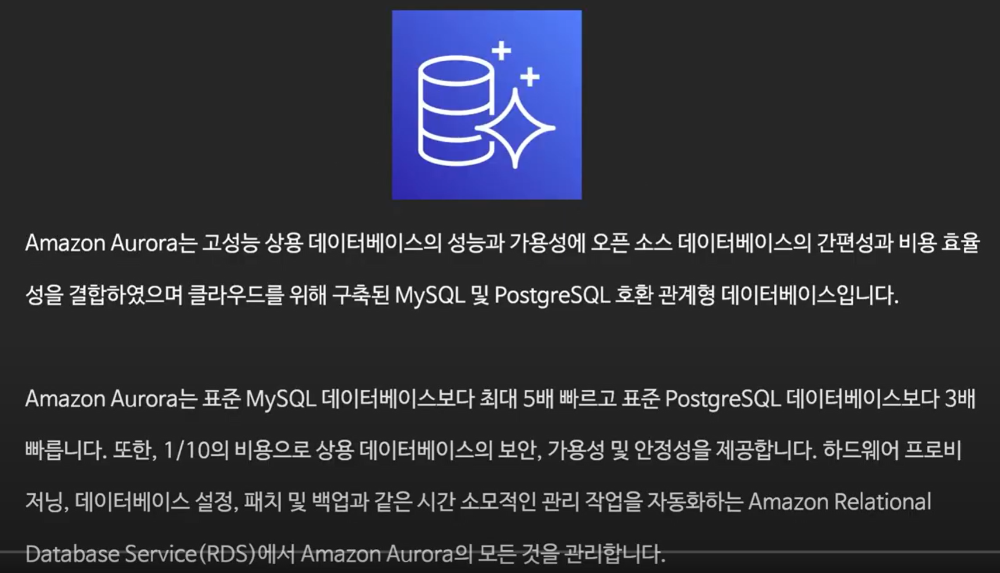
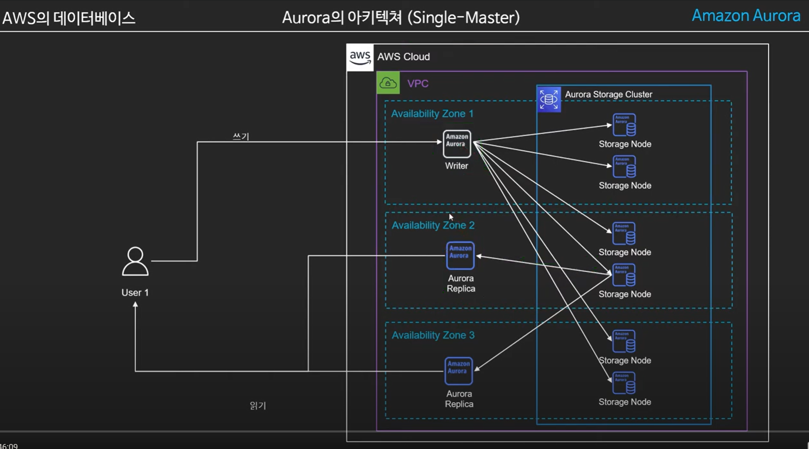
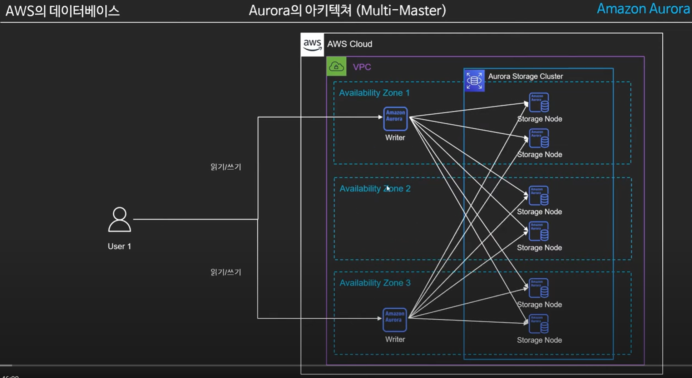

# Aurora
> https://www.youtube.com/watch?v=RImUPhD8X-o&list=PLfth0bK2MgIYeqduNcrURm5NZieCowvcK&index=2

### Aurora Architecture

- 두가지 모드 
  - 다수의 노드로 읽기 쓰기가 가능한 Multi-Master
  - 한개의 쓰기전용 노드와 다수의 읽기전용노드(Aurora Replicas) 구성의 Single-Master
  - 대부분 싱글마스터를 쓴다. 멀티마스터는 몇몇기능 사용이 불가능하다
- 용량의 자동 증감 : 10GB~128TB까지 자동으로 늘어난다.
- 데이터의 분산저장 : 각 AZ마다 2개의 데이터 복제본 저장. 최소3개이상의 AZ에 배치. 최소6개의 복제본이됨

10분부터...다시
