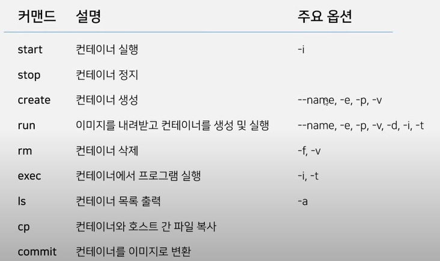

- SpringBoot gradle프로젝트 docker에 배포하기 
https://www.youtube.com/watch?v=p-_joOa0lH0
- 스프링 부트 Dockerfile 만들기 [ 도커 (Docker) 기초 ]
https://www.youtube.com/watch?v=MsMHStVibEk
- 도커강의
https://www.youtube.com/playlist?list=PLlTylS8uB2fDLJRJCXqUowsOViG-ZKnWy

# Docker


### Docker란 (1강)
- 컨테이너 기반 오픈소스 가상화 플랫폼
    > ##### 컨테이너?
    > - os상에 논리적인 영역을 구축, 어플리케이션이 작동하는데 필요한 요소들을 모아 별도서버처럼 동작
    > - 필요한 요소만 있어서 오버해드가 적음. (주요 커널의 일부분만 셋팅해서 쓸대없는 OS기능은 배제)
    > - 
- 어떤프로그램을 외부 환경과 격리시켜 구동할수 있게 해줌


### DockerContainer 구조 (2-3강)
https://www.youtube.com/watch?v=M25Pl0tX8yw&list=PLlTylS8uB2fDLJRJCXqUowsOViG-ZKnWy&index=2
- 도커컨테이너는 컨테이너 레이어와 이미지 레이어로 구성되어있음
   
- 읽기전용이미지 Layer에서 이미지를 컨테이너(WR가능)레이어로 올려서 사용
- 변경되는 사항들은 전부 컨테이너 레이어에 저장된다.
- 컨테이너 레이어는 각기 다른 컨테이너가 공유하지 않는 계층으로 이미지레이어를 공유해서 사용함
   
- 용량이 절약되는 장점이 있음


### Docker Command 구조
- 도커 명령은 'docker'로 시작하며 어떤 대상에게 명령어를 실행할 것인지 구분
    >
- 커맨드 리스트 확인 방법
  >- 'docker' 입력
  >- 'docker [commdand대상] --help'
  >- 위와같은 방법으로 커맨드 수준을 높이고 뒤에 --help입력 을 해서 알아볼수 있음

### 'docker container' 관련 커맨드
>

### 'docker image' 관련 커맨드
>

### 주요옵션


### docker Container 통신하기(4-5강)
- 도커 컨테이너는 기본적으로 독립적인 환경에서 실행된다 : 컨테이너 밖에서는 접근 불가
- p 옵션을 통해 포트를 열어서 통신한다.
    > -p ${host_port}:&{container_port}
    > - ex> docker container run --name test -d -p 8080:80 httpd
    > - -d : 백그라운드로 돌아라~ 라는 뜻임
- 이설정을 사용하기 위해서는 사용중인 포트와 겹치지 않는지 확인해야함~


### Dockerfile 작성하기  (6-7강)
- dockerfile : 도커 이미지를 생성하기위한 스크립트 파일
- 여러 키워드를 사용하여 Dockerfile을 작성하여 빌드를 보다 쉽게 수행
    >- From : base image를 지정
    >- run : 이미지 빌드 할때 사용하는 커맨드를 설정
    >- add : 이미지에 호스트의 파일이나 폴더를 추가하기 위해 사용. 복사하려는 디렉토리가 없으면 자동 생성됨
    >- copy : 호스트의 파일이나 폴더를 이미지 안으로 복사. URL지정하거나 하는 작업 안됨, 압축파일은 자동으로 풀지 않음
    >- expose : 이미지가 통신에 사용할 포트를 지정
    >- env : 환경변수를 지정할때 사용 ${name} 이렇식으로 사용 // -${name:-else} name이 없으면 -else를 실행하도록 설정가능
    >- cmd : 도커 컨테이너가 실행될때 실행할 내용 지정
    >- entrypoint : 도커 이미지가 실행될때 사용되는 기본커맨드 지정(강제적)
    >- workdir : run, cmd, entrypoint 등을 사용한 커맨를 실행하는 위치 지정
    >- volume : 퍼시스턴스데이터를 저장할 경로를 지정할때 사용 (휘발되면 안되는 데이터를 호스트의 디렉토리에 저장하도록)
    >- .... 등등 여러개가 더 있다고 한다.

### Docker Build 커맨드  
- dockerfile을 실행하기 위해서는 docker build 커맨드를 이용  --> 해당 작업을 완료한 이미지가 생성된다.
- docker build ${option} ${dockerfile directory}
    >- ex> docker build -t test ${directory}
- 생성된 이미지를 컨테이너로 실행하기 위해서는 커맨드를 사용한다.
    >- ex> docker run --name test_app -p 80:80 test
- 'Dockerfile'은 확장자가 없이쓴다. // 이름은 항상 정확하게 저렇게 써야한다.
    >- d:/docker폴더 참조~

https://www.youtube.com/watch?v=3FY-DzXYu7E&list=PLlTylS8uB2fDLJRJCXqUowsOViG-ZKnWy&index=8
### docker-compose 작성하기(8~9)
- docker compose : 도커 애플리케이션 서비스, 네트워크, 볼륨등의 설정을 yaml형식으로 작성
  >- yaml은 tab을 허용하지 않으니 조심
- 큰틀에서 구성 요소
  >- services
  >- network
  >- volume
  >- config
  >- secret
- compose 실행하기
  > - docker-compose up
  > - f : 이름을 설정해서 사용 : docker-compose -f docker-compose-filename.yml up
  > - d : 백그라운드에서 실행

### Service
- 여러 컨테이너를 정의하는데 사용
- 
- 이렇게 한다면 frontend, backend의 컨테이너가 생성됨
- 


#### ex> elasticsearch, logstash, kibana    (https://github.com/docker/awesome-compose)
```yaml
services:
  #elasticsearch
  elasticsearch:
    image: elasticsearch:7.16.1         #이미지 정의
    container_name: es                  #별도의 이름 지정
    environment:                        #환경별수 설정
      discovery.type: single-node
      ES_JAVA_OPTS: "-Xms512m -Xmx512m"
    #바인딩될 포트를 지정
    ports:
      - "9200:9200"
      - "9300:9300"
    healthcheck:
      test: ["CMD-SHELL", "curl --silent --fail localhost:9200/_cluster/health || exit 1"]
      interval: 10s
      timeout: 10s
      retries: 3
    networks:
      - elastic
  #logStash
  logstash:
    image: logstash:7.16.1
    container_name: log
    environment:
      discovery.seed_hosts: logstash
      LS_JAVA_OPTS: "-Xms512m -Xmx512m"
    volumes:
      - ./logstash/pipeline/logstash-nginx.config:/usr/share/logstash/pipeline/logstash-nginx.config
      - ./logstash/nginx.log:/home/nginx.log
    ports:
      - "5000:5000/tcp"
      - "5000:5000/udp"
      - "5044:5044"
      - "9600:9600"
    depends_on:
      - elasticsearch
    networks:
      - elastic
    # 컨테이너가 실행된후 쉘에서 실행시킬 명령어 설정
    command: logstash -f /usr/share/logstash/pipeline/logstash-nginx.config
  #kibana
  kibana:
    image: kibana:7.16.1
    container_name: kib
    ports:
      - "5601:5601"
    #다른 컨테이너와의 의존관계 설정
    depends_on:
      - elasticsearch
    networks:
      - elastic
networks:
elastic:
driver: bridge
```

#### ex> simple local mariadb & redis
```yaml
services:
 #maria
 mariadb:
  image: mariadb:11.2.3
  container_name: maria_db
  restart: always
  environment: 
   MARIADB_ROOT_PASSWORD: mic8475
   MARIADB_DATABASE: test
   MARIADB_USER: admin
   MARIADB_PASSWORD: mic8475	
  volumes:
   - ./master_db/data:/var/lib/mysql
   - ./master_db/config/:/etc/mysql/conf.d
  ports:
   - "3307:3306"
 #redis
 redis:
  image: redis:7.2.4
  restart: always
  ports:
   - "6380:6379"
```

### docker image 생성 & 저장하기(10~11강)
- 특정 이미지에 자주 사용하는 설정을 추가하여 편하게 사용하고 싶은 경우
- 본인이 개발한 어플리케이션을 이미지로 생성하고 싶을 경우사용

### How to
- 설정을 반영되어있는 컨테이너를 이미지로 변경하는 방법
  
- 컨테이너가 있는 상황에서 아래 커맨드를 사용
  > docker commit ${container_name} ${image_name}
- Dockerfile 을 이용해서 이미지 생성
  >docker build ${option} &{dockerfile directory}
- 이미지를 파일로 추출할때
  >- save/load
  >- export/save

### Springboot DockerFile 만들기 (12강)
>https://www.youtube.com/watch?v=MsMHStVibEk&list=PLlTylS8uB2fDLJRJCXqUowsOViG-ZKnWy&index=12
>https://umanking.github.io/2021/07/11/spring-boot-docker-starter/
>https://da2uns2.tistory.com/entry/Docker-%EB%8F%84%EC%BB%A4%EC%97%90-Spring-Boot-%EA%B5%AC%EC%B6%95%ED%95%98%EA%B8%B07


### Docker Memory JVM heap 설정관리  (13-14)
- InitialRamPercentage
  - java의 초기 힙사이즈설정. 기본: 1.5625%
- MinRamPercentage
  - 적은 메모리사이즈에서 운영되는 어플리케이션의 최대 힙사이즈를 설정하기위해사용. 기본50%
  - MaxRamPercentage 설정값은 무시됨
  - 보통 200m 정도를 사용하는 어플리케이션이 여기에 관계됨
- MaxRamPercentage 
  - 충분한 양의 메모리에서 운영되는 어플리케이션 최대 힙 사이즈 설정. 기본 25%
  - MinRamPercentage의 범주에 속하지 않는애들이야기
- 아래와 같이 동작된다고 한다.

- 도커에서 실행시 지정하는 메모리는 docker container별로 지정된 메모리이다. JVM의 설정 메모리는 아니다..

  > - 메모리를 늘려서 실행했지만 위 이미지 표처럼 jvm메모리는 같음이 보인다.
- 메모리를 좀더 바꿔서 해보자.

  >
  >
  > 
- 4기가 POD에 컨테이너를 올렸을때 JVM은 실제 1G램의 HEAP을 받는다
  - pod usage / container usage / reain(idle) memory 등이 잡고 있다는뜻..
  - 이걸 기준으로 jvm의 메모리설정을 아래처럼 변경할 필요가 있을것이다.
  - 


### redis cluster 구성 (15)
> https://www.youtube.com/watch?v=ZcFJz2vmt3Y&list=PLlTylS8uB2fDLJRJCXqUowsOViG-ZKnWy&index=15
> D:\docker\redis-compose-exmaple\cluster 내용참고
